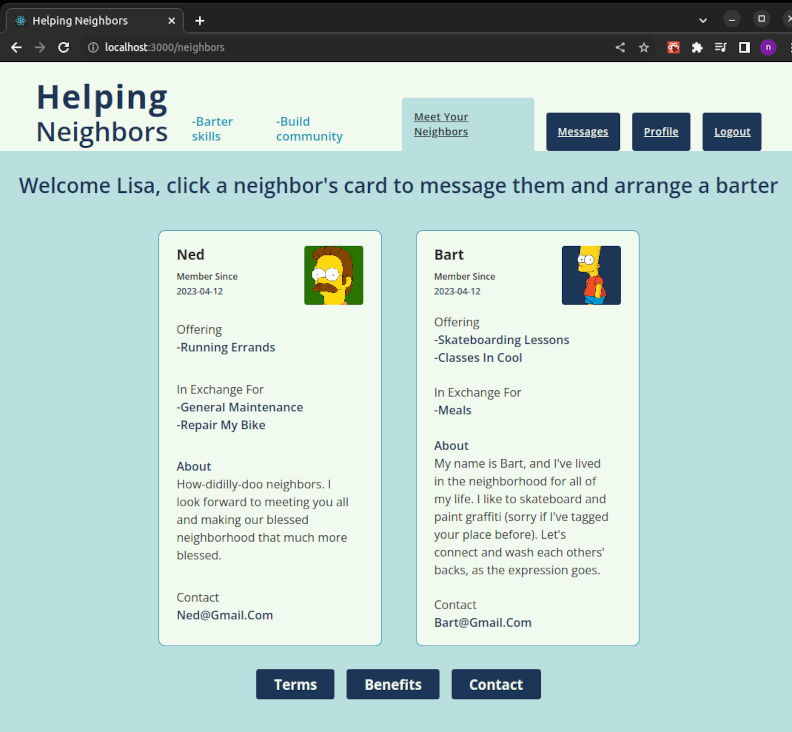
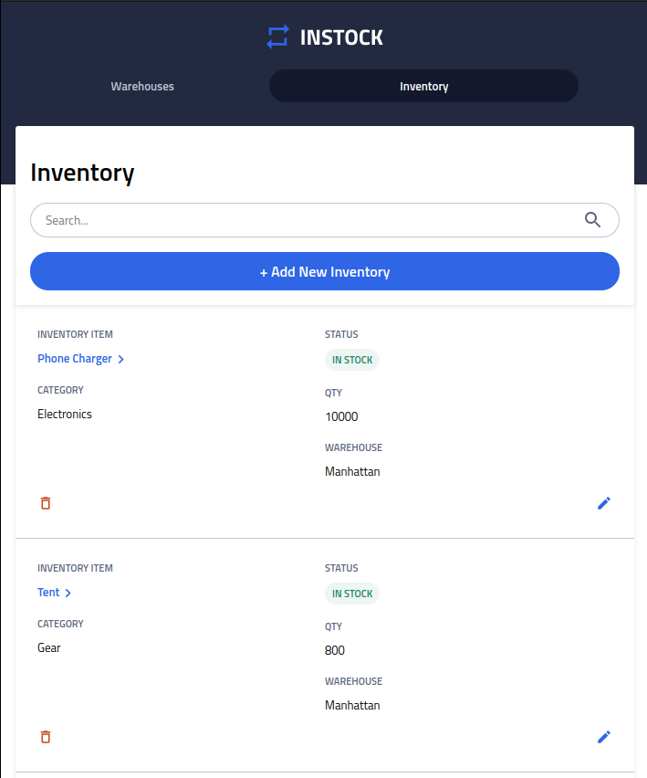

### Welcome 👋 and thanks for looking

Currently finishing my Helping Neighbors project, a full stack application to connect users based off of location with the objective of bartering skills and building communities. 

>It utilizes MySQL spatial relations that utilizes the Knex.js node package for safer querying. 

>Built with React, SASS, Axios, React-Router-Dom, Multer, and Express.  

Previous project: InStock, a full stack warehouse inventory application built in collaboration with other members of my BrainStation cohort using a group agile development style. 

>Built with React, Express, MySQL, Axios, and SASS.

I am looking for meaningful project to get involved in so please reach out if you have an inkling to. 

📫 mrnicholaskunz@gmail.com

<!--
**ntkunz/ntkunz** is a ✨ _special_ ✨ repository because its `README.md` (this file) appears on your GitHub profile.

Here are some ideas to get you started:

- 🔭 I’m currently working on ...
- 🌱 I’m currently learning ...
- 👯 I’m looking to collaborate on ...
- 🤔 I’m looking for help with ...
- 💬 Ask me about ...
- 📫 How to reach me: ...
- 😄 Pronouns: ...
- ⚡ Fun fact: ...
-->
